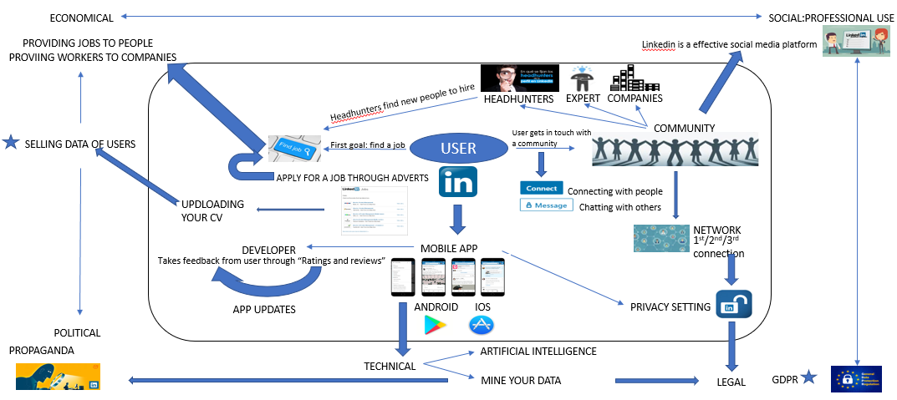

## 📘 Course Information

- **Course Name:** Algorithmic Problem Solving
- **Course Code:** 23ECSE309
- **Name:** Mohammad Arman Khan
- **USN:** 01FE21BCI037
- **University:** KLE Technological University, Hubballi-31

## 📑 Table of Contents

1. [Introduction](#introduction)
2. [Business Cases](#business-cases)
   - [Existing Functionalities](#existing-functionalities)
   - [Proposed Functionalities](#proposed-functionalities)
   - [Detailed Business Use Cases](#detailed-business-use-cases)
3. [Performance Analysis](#performance-analysis)
4. [References](#references)

## Introduction

LinkedIn is a professional networking platform designed to connect professionals worldwide, facilitating career development, networking opportunities, and knowledge exchange. It serves as a digital hub where individuals and businesses showcase their professional profiles, share industry insights, and collaborate on projects. LinkedIn relies on Data Structures and Algorithms (DSA) to improve search results, recommend relevant connections and content, manage user interactions, ensure data security, and enhance overall platform performance. They play a crucial role in optimizing user experiences and facilitating effective professional networking and career development on the platform.

### Market Analysis

LinkedIn has established itself as a dominant force in professional networking with significant market reach and impact. According to 99Firms, as of 2020, LinkedIn reported revenue of $8.05 billion and boasts over 830 million members globally. A substantial portion, approximately 31%, of LinkedIn's traffic originates from the United States. The platform has seen a notable surge in activity, particularly with a tripling of searches for remote work following the onset of the COVID-19 pandemic. Weekly job searches on LinkedIn reach up to 50 million, with 122 million individuals reportedly securing interviews through the platform. LinkedIn stands out in B2B lead generation, responsible for 80% of such leads from social media platforms. It's also recognized as the top-rated organic social media platform for B2B marketers, underscoring its pivotal role in professional networking and recruitment strategies worldwide.[[1]](https://99firms.com/blog/linkedin-statistics/#gref){:target="_blank"}

## References

[1] “Topic: LinkedIn Market Stats” 99firms, Apr. 24, 2024.    

